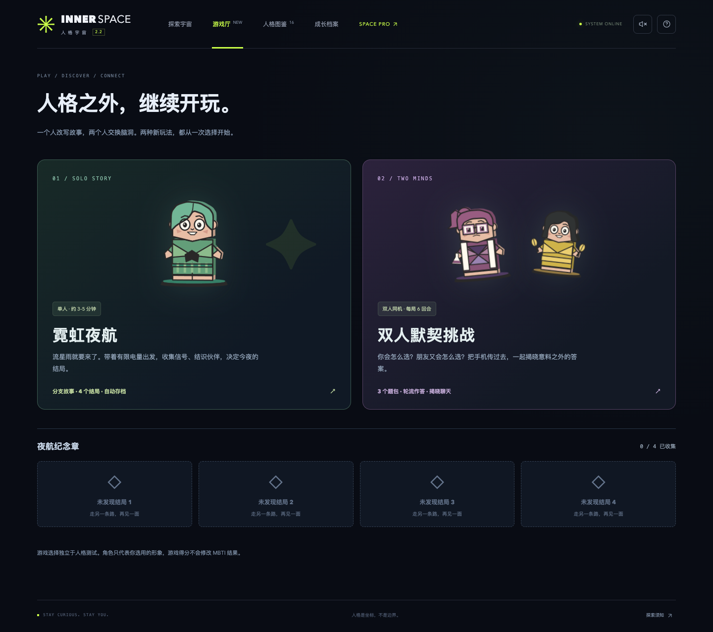
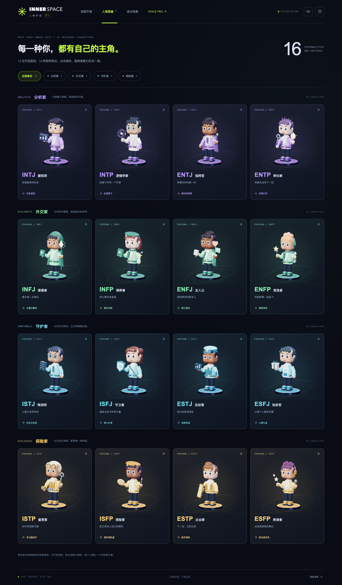
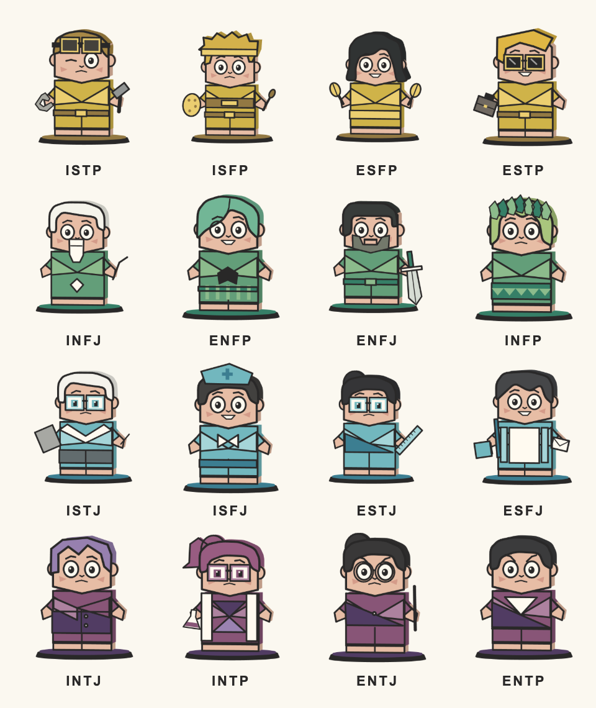

# INNER SPACE · 人格宇宙 2.2

赛博朋克风格的 3D MBTI 自我探索 H5：霓虹悬浮城市、三档情境测试、人格报告与成长档案。支持桌面、手机触摸和键盘操作。


## 两种新玩法

首页、测试结果页或导航「游戏厅」均可进入。调研来源、设计取舍与验收说明见 [玩法调研](docs/gameplay-research.md)。

- **霓虹夜航**：6 步原创分支故事，管理电量、信号与同行关系；10 个途中节点、111 条完整路线、4 种可收集结局。角色可选、3D 可旋转，选择后有明确反馈；进度与收藏在本机保存。
- **双人默契挑战**：两人共用一台设备，轮流选择自己的答案并预测对方。3 个题包、18 个情境、每局 6 回合，交接幕保护揭晓前的答案，结算按实际选择计分并提供聊天话题。双人答案仅保留在本次页面，刷新清空，不上传。

两种玩法不修改人格评分，也不输出所谓人格兼容度。



## 功能

- **12 / 32 / 60 题**：快速扫描、标准探索、深度解码；60 个独立情境，每维 15 题，各档覆盖四维且题量均衡。
- **四座 3D 城市**：能量矩阵、灵感幻境、共鸣网络、秩序之城；拖动旋转、岛屿点选、答题反馈、减少动态。
- **16 款描边 3D 卡通角色**：紫色分析家、绿色外交家、青蓝守护者、金色探险家；参考图风格的方块身形、圆眼、粗描边、几何服装与专属道具。图鉴筛选、拖动旋转、招呼动作、动态暂停，测试结果、报告和 PNG 卡片联动。
- **16 人格与四维比例**：均衡维度明确标记，页面、历史、导出卡片均保留临时类型提示。
- **深度报告**：优势倾向、观察盲区、工作协作和关系沟通建议、雷达与维度图。
- **7 日成长计划**：按人格偏好生成行动建议，每份报告独立保存打卡。
- **成长档案**：保留最近 30 份记录，选择任意两份对比维度变化；删除需确认。
- **导出**：1080×1440 PNG 人格卡、完整 HTML 报告；HTML 可直接打印或保存为 PDF。
- **进度保存**：每个档位独立续答，返回修改不会删除后续答案；自动迁移旧版 12 题进度。

所有数据仅保存在本机浏览器，无登录、云同步、第三方素材或字体请求。高级功能当前开放体验，没有实际收费。后续商业化边界与接口设计见 [商业化接入说明](docs/commercialization.md)。

## 运行

需要 Node.js 20.19+ 或 22.12+。

```sh
npm install
npm run dev -- --port 5188
npm test
npm run build
npm run preview -- --port 5189
```

构建目录 `dist/` 可部署到静态托管根路径。子路径部署需另配置 Vite `base`。本次交付没有进行线上部署。

## 验证

```sh
# 启动构建预览 5189 和开发服务 5188 后：
node artifacts/v2-check.mjs
node artifacts/character-check.mjs
node artifacts/gameplay-check.mjs
```

浏览器测试默认使用 macOS 系统 Chrome，可用 `CHROME_PATH` 指定其他 Chromium 可执行文件，用 `TEST_URL` 指定生产预览地址。它通过真实点击/触摸完成三档测试，并检查进度、报告、下载、打卡、对比、删除和手机布局。开发服务仅用于最后采集 renderer 诊断。详细证据见 [验证记录](artifacts/final-evidence.md)。

## 代码

| 模块 | 职责 |
| --- | --- |
| `src/adventure.js` / `src/duo.js` | 分支故事与双人挑战的纯规则、原创新情境 |
| `src/playground.js` / `src/playground.css` | 游戏厅、交接幕、回响、结算与手机交互 |
| `src/play-store.js` | 冒险路径重放校验、自动存档与去重收藏 |
| `src/scene.js` | Three.js 几何体、材质、光照、动画、合批和指针交互 |
| `src/characters.js` | 16 种角色的程序化几何、身份与动作；资源释放 |
| `src/character-viewer.js` | 可旋转角色展台、缓存缩略图、高分辨率导出肖像 |
| `src/quiz.js` | 题库、档位、评分、16 人格画像 |
| `src/reports.js` | 本地规则生成深度报告、成长计划与维度比较 |
| `src/storage.js` | 独立草稿、历史、打卡、数据校验与旧版迁移 |
| `src/export-copy.js` | 卡片导出的均衡结果文案 |
| `src/access.js` | 高级功能目录与未来服务端权益读取适配点 |
| `src/main.js` / `src/style.css` | 页面状态、交互、导出与响应式视觉 |

这不是官方 MBTI 量表或经过心理测量验证的工具。百分比只是本轮选择占比，不是置信度；题量增加代表情境覆盖更广，不等于测量准确度提升。所有建议仅供自我观察。

## 角色图鉴



同一套 Three.js 模型生成图鉴缩略图、实时角色与导出肖像。图鉴复用一个离屏渲染器，详情和结果按需创建并在离开时释放；不为 16 张卡片同时创建实时场景。所有模型随代码离线生成，无付费素材调用。

## 七牛云自动部署

工作流：`.github/workflows/deploy-qiniu.yml`。推送 `master` 或在 GitHub Actions 手动触发后，使用 Node.js 22 安装依赖、执行测试、构建，并将 `dist/` 上传至七牛 Kodo 的 `mbti/` 前缀，同名文件覆盖，不删除旧资源。

使用已配置的仓库 Secrets 或 Variables：`QINIU_AK`、`QINIU_SK`、`QINIU_BUCKET`（Secrets 优先）。工作流未指定 GitHub Environment；若变量仅存于某个 Environment，需要为 job 添加对应的 `environment`。

部署构建使用 `npm run build -- --base=/mbti/`，访问地址为绑定域名下的 `/mbti/index.html`（配置默认首页后可使用 `/mbti/`）。本地默认构建仍支持根路径。保留参考配置中的 `VITE_API_ORIGIN`，当前应用没有调用该 API。工作流不自动刷新 CDN 缓存。

上传参数依据 [七牛 qshell qupload2 文档](https://github.com/qiniu/qshell/blob/master/docs/qupload2.md)。上传失败清单非空时，工作流会标记失败。

角色造型采用平涂插画的立体挤出结构，保留可旋转厚度；侧面使用较深色块，正面维持参考图的线条和色彩。


